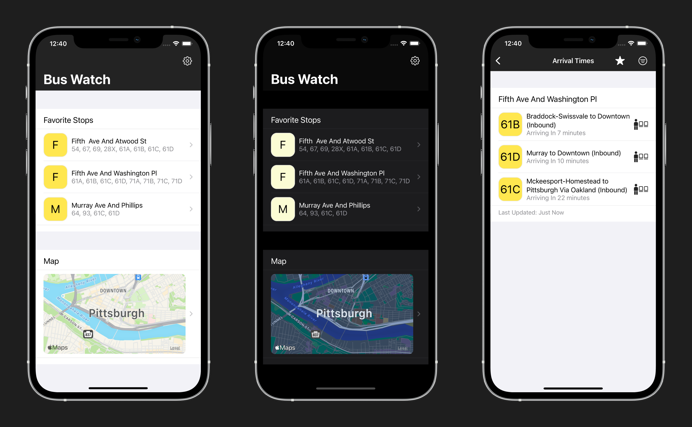

<h1 align="center">
   
  
   
  Pittsburgh Bus Watch
   
</h1>

<h4 align="center">A free, open source iOS application that shows real-time transit information for the Pittsburgh Port Authority transit system.</h4>

 

 

 

 
 

## Technologies Used

* Swift
* [Combine](https://developer.apple.com/documentation/combine)
* [GRDB](https://github.com/groue/GRDB.swift)
* MapKit
* UIKit
* URLSession
* JSON Decodable
* Model-View-View Model
