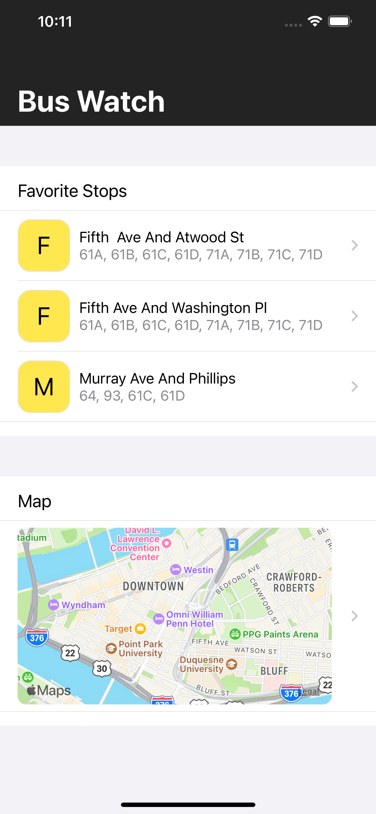
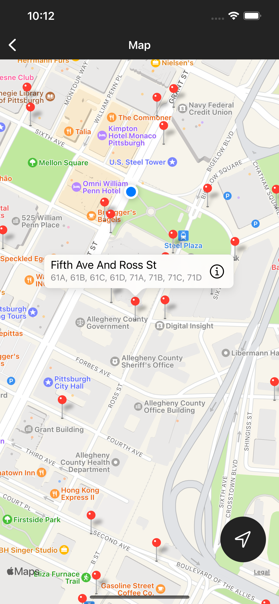

# Bus Watch

Bus Watch shows real-time transit information for the Pittsburgh Port Authority transit system. The app shows bus stops from a SQLite database in an MKMapView and retrieves transit arrival times from a [backend RESTful API](https://realtime.portauthority.org/bustime/apidoc/docs/DeveloperAPIGuide3_0.pdf).

## Technologies Used

* Swift
* [Combine](https://developer.apple.com/documentation/combine)
* [GRDB](https://github.com/groue/GRDB.swift)
* MapKit
* UIKit
* URLSession
* JSON Decodable
* Model-View-View Model

## Screenshots

  
  
Overview screen showing favorite stops and a map of stops

 

  
  
Map screen showing transit stops using MapKit

 

  
  
Predictions screen showing real-time bus arrival times

